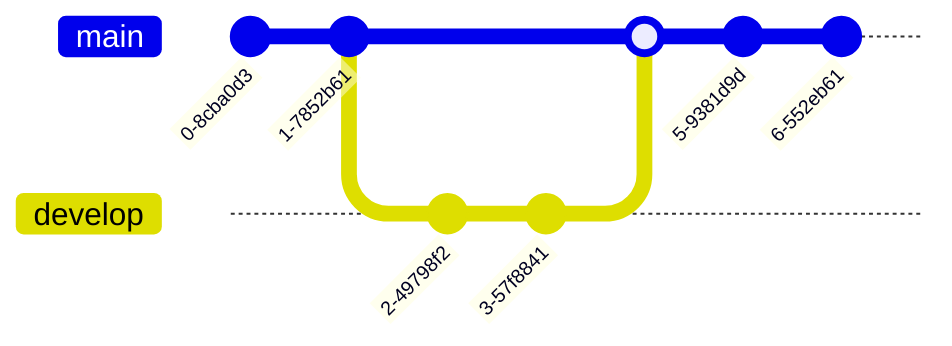

+++
categories = ['howto', 'reference']
description = 'Generate diagrams and flowcharts from text'
frontmatter = ['customMermaidURL', 'mermaid.force', 'mermaidInitialize', 'mermaidZoom']
options = ['customMermaidURL', 'mermaid.force', 'mermaidInitialize', 'mermaidZoom']
title = 'Mermaid'
+++

The `mermaid` shortcode generates diagrams and flowcharts from text using the [Mermaid](https://mermaidjs.github.io/) library.

````mermaid {align="center" zoom="true"}
graph LR;
  If --> Then
  Then --> Else
````

## Usage


{}

````md

````

{}
{}

````go

graph LR;
  If --> Then
  Then --> Else

````

{}
{}

````go
{{ partial "shortcodes/mermaid.html" (dict
  "page"    .
  "content" "graph LR;\n  If --> Then\n  Then --> Else"
  "align"   "center"
  "zoom"    "true"
)}}

````

{}


Markdown codefence syntax is widely available in other Markdown parsers like GitHub and therefore is the recommend syntax for generating portable Markdown.

### Parameter

| Name                  | Default          | Notes       |
|-----------------------|------------------|-------------|
| **align**             | `center`         | The vertical alignment.<br><br>Allowed values are `left`, `center` or `right`. |
| **zoom**              | see notes        | Whether the graph is pan- and zoomable.<br><br>If not set the value is determined by the [`mermaidZoom` setting](#configuring-pan-and-zoom) of your configurations options or the pages front matter or `false` if not set at all.<br><br>- `false`: no pan or zoom<br>- `true`: pan and zoom active |
| _**&lt;content&gt;**_ | _&lt;empty&gt;_  | Your Mermaid graph. |

## Settings

### Configuring Pan and Zoom

{}Option{} {}Front Matter{} The generated graphs can be panned by dragging them and zoomed by using the mousewheel. On mobile devices you can use finger gestures.

By default this is disabled. Set `mermaidZoom=true` to enable it.

Individual settings of a graphs [`zoom` parameter](#parameter) have precedence over the page's front matter and configuration options in that order.


mermaidZoom = true


### Providing Initialization Options for the Mermaid Library

{}Option{} {}Front Matter{} The Mermaid library is configured with default settings for initialization.

You can overwrite the settings by providing a JSON object in `mermaidInitialize`. See [Mermaid's documentation](https://mermaid-js.github.io/mermaid/#/Setup?id=mermaidapi-configuration-defaults) for all allowed settings.

> [!NOTE]
> Using the `theme` setting in the initialization options is unsupported. To set the theme globally edit the `--MERMAID-theme` variable of your [color variant](configuration/branding/colors/#modifying-variants).

Keep in mind that initialization settings of your pages front matter overwrite all settings of your configuration options.

In addition, you can merge settings for each individual graph through [diagram directives](https://mermaid-js.github.io/mermaid/#/directives?id=directives) on top of the settings of your page's front matter or configuration options.


mermaidInitialize = '{ "securityLevel": "loose" }'


### Loading an External Version of the Mermaid Library

{}Option{} {}Front Matter{} The theme uses the shipped Mermaid library by default.

In case you want do use a different version of the Mermaid library but don't want to override the shipped version, you can set `customMermaidURL` to the URL of the external Mermaid library.


customMermaidURL = 'https://unpkg.com/mermaid/dist/mermaid.min.js'


### Force Loading of the Mermaid Library

{}Option{} {}Front Matter{} The Mermaid library will be loaded if the page contains an `mermaid` shortcode, Markdown codefence or the partial is called from your templates.

You can force loading the Mermaid library if no shortcode, Markdown codefence or partial was called by setting `mermaid.force=true`. If a shortcode, Markdown codefence or partial was called, this option has no effect. This comes handy in case you are using scripting to render a graph.


mermaid.force = true


### Setting a Specific Mermaid Theme

While you can configure the Mermaid theme to render your graph by using one of the [initialization options](#providing-initialization-options-for-the-mermaid-library), the recommended way is to set the default value using the `--MERMAID-theme` variable in your [color variant stylesheet](configuration/branding/generator). This allows your graphs to look pretty when the user switches the color variant.

## Examples

### Flowchart with YAML-Title

````md

````

````mermaid
---
title: Example Diagram
---
graph LR;
  A[Hard edge] -->|Link text| B(Round edge)
  B --> C{<strong>Decision</strong>}
  C -->|One| D[Result one]
  C -->|Two| E[Result two]
````

### Sequence Diagram with Configuration Directive

````md

````

````mermaid
%%{init:{"fontFamily":"monospace", "sequence":{"showSequenceNumbers":true}}}%%
sequenceDiagram
  Alice->>John: Hello John, how are you?
  loop Healthcheck
      John->>John: Fight against hypochondria
  end
  Note right of John: Rational thoughts!
  John-->>Alice: Great!
  John->>Bob: How about you?
  Bob-->>John: Jolly good!
````

### Class Diagram

````md

````

````mermaid
classDiagram
  Animal <|-- Duck
  Animal <|-- Fish
  Animal <|-- Zebra
  Animal : +int age
  Animal : +String gender
  Animal: +isMammal()
  Animal: +mate()
  class Duck{
    +String beakColor
    +swim()
    +quack()
  }
  class Fish{
    -int sizeInFeet
    -canEat()
  }
  class Zebra{
    +bool is_wild
    +run()
  }
````

### State Diagram Aligned to the Right Using Shortcode Syntax

````go

stateDiagram-v2
  open: Open Door
  closed: Closed Door
  locked: Locked Door
  open   --> closed: Close
  closed --> locked: Lock
  locked --> closed: Unlock
  closed --> open: Open

````


stateDiagram-v2
  open: Open Door
  closed: Closed Door
  locked: Locked Door
  open   --> closed: Close
  closed --> locked: Lock
  locked --> closed: Unlock
  closed --> open: Open


### Entity Relationship Model with Non-Default Mermaid Theme

````md

````

````mermaid
%%{init:{"theme":"forest"}}%%
erDiagram
  CUSTOMER }|..|{ DELIVERY-ADDRESS : has
  CUSTOMER ||--o{ ORDER : places
  CUSTOMER ||--o{ INVOICE : "liable for"
  DELIVERY-ADDRESS ||--o{ ORDER : receives
  INVOICE ||--|{ ORDER : covers
  ORDER ||--|{ ORDER-ITEM : includes
  PRODUCT-CATEGORY ||--|{ PRODUCT : contains
  PRODUCT ||--o{ ORDER-ITEM : "ordered in"
````

### User Journey

````md

````

````mermaid
journey
  title My working day
  section Go to work
    Make tea: 5: Me
    Go upstairs: 3: Me
    Do work: 1: Me, Cat
  section Go home
    Go downstairs: 5: Me
    Sit down: 3: Me
````

### GANTT Chart

````md

````

````mermaid
gantt
  dateFormat  YYYY-MM-DD
  title Adding GANTT diagram functionality to Mermaid
  section A section
  Completed task            :done,    des1, 2014-01-06,2014-01-08
  Active task               :active,  des2, 2014-01-09, 3d
  Future task               :         des3, after des2, 5d
  Future task2              :         des4, after des3, 5d
  section Critical tasks
  Completed task in the critical line :crit, done, 2014-01-06,24h
  Implement parser and jison          :crit, done, after des1, 2d
  Create tests for parser             :crit, active, 3d
  Future task in critical line        :crit, 5d
  Create tests for renderer           :2d
  Add to Mermaid                      :1d
````

### Pie Chart without Zoom

````md

````

````mermaid {zoom="false"}
pie title Pets adopted by volunteers
  "Dogs" : 386
  "Cats" : 85
  "Rats" : 15
````

### Quadrant Chart

````md

````

````mermaid
quadrantChart
  title Reach and engagement of campaigns
  x-axis Low Reach --> High Reach
  y-axis Low Engagement --> High Engagement
  quadrant-1 We should expand
  quadrant-2 Need to promote
  quadrant-3 Re-evaluate
  quadrant-4 May be improved
  Campaign A: [0.3, 0.6]
  Campaign B: [0.45, 0.23]
  Campaign C: [0.57, 0.69]
  Campaign D: [0.78, 0.34]
  Campaign E: [0.40, 0.34]
  Campaign F: [0.35, 0.78]
````

### Requirement Diagram

````md

````

````mermaid
requirementDiagram

  requirement test_req {
    id: 1
    text: the test text.
    risk: high
    verifymethod: test
  }

  element test_entity {
    type: simulation
  }

  test_entity - satisfies -> test_req
````

### Git Graph

````md

````

````mermaid
gitGraph
  commit
  commit
  branch develop
  checkout develop
  commit
  commit
  checkout main
  merge develop
  commit
  commit
````

### C4 Diagrams

````md

````

````mermaid
C4Context
  title System Context diagram for Internet Banking System
  Enterprise_Boundary(b0, "BankBoundary0") {
    Person(customerA, "Banking Customer A", "A customer of the bank, with personal bank accounts.")
    Person(customerB, "Banking Customer B")
    Person_Ext(customerC, "Banking Customer C", "desc")
    Person(customerD, "Banking Customer D", "A customer of the bank, <br/> with personal bank accounts.")

    System(SystemAA, "Internet Banking System", "Allows customers to view information about their bank accounts, and make payments.")

    Enterprise_Boundary(b1, "BankBoundary") {
      SystemDb_Ext(SystemE, "Mainframe Banking System", "Stores all of the core banking information about customers, accounts, transactions, etc.")

      System_Boundary(b2, "BankBoundary2") {
        System(SystemA, "Banking System A")
        System(SystemB, "Banking System B", "A system of the bank, with personal bank accounts. next line.")
      }

      System_Ext(SystemC, "E-mail system", "The internal Microsoft Exchange e-mail system.")
      SystemDb(SystemD, "Banking System D Database", "A system of the bank, with personal bank accounts.")

      Boundary(b3, "BankBoundary3", "boundary") {
        SystemQueue(SystemF, "Banking System F Queue", "A system of the bank.")
        SystemQueue_Ext(SystemG, "Banking System G Queue", "A system of the bank, with personal bank accounts.")
      }
    }
  }

  BiRel(customerA, SystemAA, "Uses")
  BiRel(SystemAA, SystemE, "Uses")
  Rel(SystemAA, SystemC, "Sends e-mails", "SMTP")
  Rel(SystemC, customerA, "Sends e-mails to")

  UpdateElementStyle(customerA, $fontColor="red", $bgColor="grey", $borderColor="red")
  UpdateRelStyle(customerA, SystemAA, $textColor="blue", $lineColor="blue", $offsetX="5")
  UpdateRelStyle(SystemAA, SystemE, $textColor="blue", $lineColor="blue", $offsetY="-10")
  UpdateRelStyle(SystemAA, SystemC, $textColor="blue", $lineColor="blue", $offsetY="-40", $offsetX="-50")
  UpdateRelStyle(SystemC, customerA, $textColor="red", $lineColor="red", $offsetX="-50", $offsetY="20")

  UpdateLayoutConfig($c4ShapeInRow="3", $c4BoundaryInRow="1")
````

### Mindmaps

````md

````

````mermaid
mindmap
  root((mindmap))
    Origins
      Long history
      ::icon(fa fa-book)
      Popularisation
        British popular psychology author Tony Buzan
    Research
      On effectiveness<br/>and features
      On Automatic creation
        Uses
            Creative techniques
            Strategic planning
            Argument mapping
    Tools
      Pen and paper
      Mermaid
````

### Timeline

````md

````

````mermaid
timeline
  title History of Social Media Platform
  2002 : LinkedIn
  2004 : Facebook
       : Google
  2005 : Youtube
  2006 : Twitter
````

### ZenUML

ZenUML is currently not available with the Mermaid version shipped with the theme due to further required dependencies. Use [sequence diagrams](#sequence-diagram-with-configuration-directive) instead.

<!--
````md

````

````mermaid
zenuml
    title Annotators
    @Actor Alice
    @Database Bob
    Alice->Bob: Hi Bob
    Bob->Alice: Hi Alice
````
-->

### Sankey

````md

````

````mermaid
sankey-beta
  %% source,target,value
  Electricity grid,Over generation / exports,104.453
  Electricity grid,Heating and cooling - homes,113.726
  Electricity grid,H2 conversion,27.14
````

### XYChart

````md

````

````mermaid
xychart-beta
  title "Sales Revenue"
  x-axis [jan, feb, mar, apr, may, jun, jul, aug, sep, oct, nov, dec]
  y-axis "Revenue (in $)" 4000 --> 11000
  bar [5000, 6000, 7500, 8200, 9500, 10500, 11000, 10200, 9200, 8500, 7000, 6000]
  line [5000, 6000, 7500, 8200, 9500, 10500, 11000, 10200, 9200, 8500, 7000, 6000]
````

### Block Diagram

````md

````

````mermaid
block-beta
  columns 1
    db(("DB"))
    blockArrowId6<["&nbsp;&nbsp;&nbsp;"]>(down)
    block:ID
      A
      B["A wide one in the middle"]
      C
    end
    space
    D
    ID --> D
    C --> D
    style B fill:#969,stroke:#333,stroke-width:4px
````

### Packet

````md

````

````mermaid
---
title: "TCP Packet"
---
packet-beta
  0-15: "Source Port"
  16-31: "Destination Port"
  32-63: "Sequence Number"
  64-95: "Acknowledgment Number"
  96-99: "Data Offset"
  100-105: "Reserved"
  106: "URG"
  107: "ACK"
  108: "PSH"
  109: "RST"
  110: "SYN"
  111: "FIN"
  112-127: "Window"
  128-143: "Checksum"
  144-159: "Urgent Pointer"
  160-191: "(Options and Padding)"
  192-255: "Data (variable length)"
````

### Kanban

````md

````

````mermaid
---
config:
  kanban:
    ticketBaseUrl: 'https://mermaidchart.atlassian.net/browse/#TICKET#'
---
kanban
  Todo
    [Create Documentation]
    docs[Create Blog about the new diagram]
  [In progress]
    id6[Create renderer so that it works in all cases. We also add som extra text here for testing purposes. And some more just for the extra flare.]
  id9[Ready for deploy]
    id8[Design grammar]@{ assigned: 'knsv' }
  id10[Ready for test]
    id4[Create parsing tests]@{ ticket: MC-2038, assigned: 'K.Sveidqvist', priority: 'High' }
    id66[last item]@{ priority: 'Very Low', assigned: 'knsv' }
  id11[Done]
    id5[define getData]
    id2[Title of diagram is more than 100 chars when user duplicates diagram with 100 char]@{ ticket: MC-2036, priority: 'Very High'}
    id3[Update DB function]@{ ticket: MC-2037, assigned: knsv, priority: 'High' }

  id12[Can't reproduce]
    id3[Weird flickering in Firefox]
````

### Architecture

````md
```mermaid
architecture-beta
  group api(cloud)[API]

  service db(database)[Database] in api
  service disk1(disk)[Storage] in api
  service disk2(disk)[Storage] in api
  service server(server)[Server] in api

  db:L -- R:server
  disk1:T -- B:server
  disk2:T -- B:db
```
````

````mermaid
architecture-beta
  group api(cloud)[API]

  service db(database)[Database] in api
  service disk1(disk)[Storage] in api
  service disk2(disk)[Storage] in api
  service server(server)[Server] in api

  db:L -- R:server
  disk1:T -- B:server
  disk2:T -- B:db
````

### Radar

````md
```mermaid
---
title: "Grades"
---
radar-beta
  axis m["Math"], s["Science"], e["English"]
  axis h["History"], g["Geography"], a["Art"]
  curve a["Alice"]{85, 90, 80, 70, 75, 90}
  curve b["Bob"]{70, 75, 85, 80, 90, 85}

  max 100
  min 0
```
````

````mermaid
---
title: "Grades"
---
radar-beta
  axis m["Math"], s["Science"], e["English"]
  axis h["History"], g["Geography"], a["Art"]
  curve a["Alice"]{85, 90, 80, 70, 75, 90}
  curve b["Bob"]{70, 75, 85, 80, 90, 85}

  max 100
  min 0
````

### Treemap

````md
```mermaid
treemap-beta
"Section 1"
    "Leaf 1.1": 12
    "Section 1.2"
      "Leaf 1.2.1": 12
"Section 2"
    "Leaf 2.1": 20
    "Leaf 2.2": 25
```
````

````mermaid
treemap-beta
"Section 1"
    "Leaf 1.1": 12
    "Section 1.2"
      "Leaf 1.2.1": 12
"Section 2"
    "Leaf 2.1": 20
    "Leaf 2.2": 25
````
